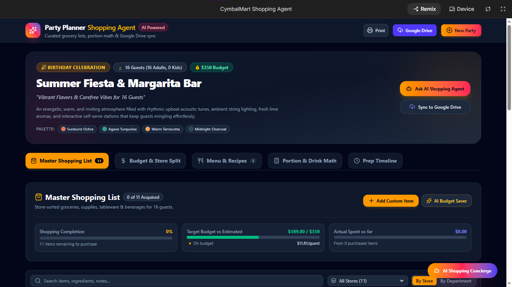

<div align="center">

</div>

# CymbalMart Shopping Agent
## An AI-Powered Party Planner & Budgeting Assistant

---

## 📋 Project Overview

The **CymbalMart Shopping Agent** is an intelligent event planning application that transforms Critical User Journeys (CUJs) into curated, budget-conscious shopping lists. Leveraging Google's Gemi[...]

The agent seamlessly guides users through event planning by:
- **Generating comprehensive event themes** with curated menus and portion guides
- **Creating master shopping lists** tailored to event requirements and budget
- **Enabling real-time budget adjustments** as users modify quantities and prices
- **Providing voice-activated interactions** for hands-free list management and queries

---

## Screenshots

### Party Planning Dashboard



### Add a New Party Plan


---

## ✨ Key Features

### 🎨 **AI Party Planner**
Generates event themes, curated menus, portion guides, and master shopping lists based on user preferences and budget constraints.

### 💬 **CymbalMart Assistant Chatbot**
Interactive AI concierge that allows users to modify plans, ask event-related questions, and receive personalized recommendations in real-time.

### 💰 **Dynamic Budget Recalculation**
Real-time total budget updates whenever item quantities or prices are adjusted, ensuring users stay within their financial limits.

### 🎤 **Hands-Free Voice Control**
Seamless voice recognition powered by the browser Web Speech API (SpeechRecognition), enabling users to manage their shopping lists and interact with the assistant completely hands-free.

---

## 🛠️ Tech Stack

- **Frontend Framework:** React with TypeScript
- **Build Tool:** Vite
- **Styling:** Tailwind CSS
- **AI & LLM:** Google AI Studio / Gemini API
- **Voice Input:** Web Speech API (SpeechRecognition)
- **Animations & Celebrations:** Canvas Confetti

---

## 🚀 Quickstart / Local Setup

### Prerequisites
- **Node.js** (v16 or higher recommended)

### Installation & Running Locally

1. **Install dependencies:**
   ```bash
   npm install
   ```

2. **Set up your Gemini API key:**
   - Create a `.env.local` file in the project root
   - Add your Gemini API key:
     ```
     VITE_GEMINI_API_KEY=your-gemini-api-key-here
     ```

3. **Run the development server:**
   ```bash
   npm run dev
   ```

4. **Open in your browser:**
   - Navigate to `http://localhost:5173` (or the URL shown in terminal)

---

## 📱 How It Works

1. **Define Your Event:** Provide event details (date, attendee count, cuisine preferences, budget)
2. **AI Generates Plan:** Gemini creates a themed event plan with menu and shopping list
3. **Review & Adjust:** Modify items, quantities, and prices in real-time
4. **Voice Interaction:** Use voice commands to interact with the CymbalMart Assistant
5. **Budget Tracking:** Watch your total update dynamically as you refine selections
6. **Execute:** Generate your final optimized shopping list

---

## 📂 Project Structure

```
cymbalmart-shopping-agent/
├── src/
│   ├── components/      # React components
│   ├── pages/          # Page views
│   ├── services/       # Gemini API integration
│   ├── utils/          # Utility functions
│   ├── App.tsx         # Main application
│   └── main.tsx        # Entry point
├── .env.local          # Environment variables (Gemini API key)
├── vite.config.ts      # Vite configuration
├── tailwind.config.ts  # Tailwind CSS configuration
└── package.json        # Dependencies and scripts
```

---

## 🔧 Available Scripts

- `npm run dev` — Start the development server
- `npm run build` — Build for production
- `npm run preview` — Preview the production build locally
- `npm run lint` — Run ESLint (if configured)

---

## 🎯 Future Enhancements

- [ ] User authentication and profile persistence
- [ ] Shopping list export (PDF, email, SMS)
- [ ] Barcode scanning for item price lookup
- [ ] Integration with popular shopping platforms
- [ ] Multi-event comparison and analytics
- [ ] Social sharing of event plans

---

## 📄 License

This project is provided as-is for portfolio and educational purposes.

---

## 🔗 Resources

- [Google AI Studio](https://ai.studio/)
- [Gemini API Documentation](https://ai.google.dev/docs)
- [React Documentation](https://react.dev)
- [Vite Documentation](https://vitejs.dev)
- [Tailwind CSS Documentation](https://tailwindcss.com)
- [Web Speech API](https://developer.mozilla.org/en-US/docs/Web/API/Web_Speech_API)

---

**Built with ❤️ using Gemini AI & React**

---

Author: Krithika Shree K

GitHub: [@krithikashree1957](https://github.com/krithikashree1957)
